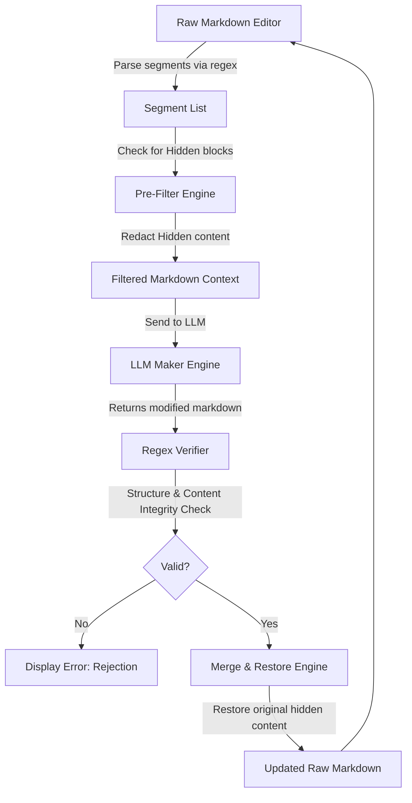

# Implementation Plan: Doc-Micro-Access-Ctr (LLM-as-Maker, Human-as-Checker)

An MVP markdown editor designed to enforce a robust **Human-in-the-Loop** verification workflow. It allows humans to classify individual markdown blocks as **Locked/Read-only**, **Hidden (Not-readable)**, or **Writable**, using inline HTML comments.

---

## 1. App Architecture & Regex Pipeline

The editor operates on raw markdown text directly from the editor panel. It uses regular expressions to parse, pre-filter, and verify the document sections.



### Classification Tags
We use standard HTML comments in the markdown editor:
- `<!-- start-readonly -->` / `<!-- end-readonly -->` (or `start-locked`/`end-locked`)
- `<!-- start-hidden -->` / `<!-- end-hidden -->` (not-readable content)
- `<!-- start-writable -->` / `<!-- end-writable -->`

### Core Regex Algorithms

1. **Sequential Segment Parser**:
   Matches comment block tags in sequence:
   ```javascript
   const blockRegex = /(<!--\s*(start-readonly|start-writable|start-hidden)\s*-->)([\s\S]*?)(<!--\s*(end-readonly|end-writable|end-hidden)\s*-->)/g;
   ```
   Any text between matches (or at the boundaries) is classified as untagged text and defaults to `readonly` to prevent accidental editing.

2. **Input Context Pre-filtering (Redaction)**:
   For any block of type `hidden`, we replace its content with the placeholder `[REDACTED - HIDDEN SECTION]` before sending it to the LLM. This prevents data leaks and reduces token usage.

3. **Output Verification Engine**:
   When the LLM returns the modified markdown, the verifier:
   - Parses the LLM output into segments.
   - Extracts all non-writable segments (readonly, hidden, and untagged whitespace) from the original and LLM outputs.
   - Verifies that:
     1. The sequence and length of non-writable segments match exactly.
     2. Read-only content has not been altered by even a single character.
     3. Hidden sections contain exactly the `[REDACTED - HIDDEN SECTION]` placeholder and nothing else.
   - If verification fails, it reports the exact violation to the user.

4. **Restore & Merge Engine**:
   If verification passes, the editor merges the changes:
   - Writable blocks are updated with their new values.
   - Hidden blocks are restored to their original secret content (unredacted).
   - Read-only blocks are restored from the original text to maintain formatting.

---

## 2. Tech Stack

- **Core Structure**: Single-page web application.
- **Vite & npm**: Local development and bundling.
- **Styling**: Vanilla CSS3 with high-end glassmorphism styling.
- **Libraries**:
  - `marked` (CDN) for Markdown rendering.
  - `diff-match-patch` or a built-in line-by-line block diff visualizer.

---

## 3. UI Layout & Features

1. **Left Panel: Raw Editor & Tags Toolbar**:
   - Monospace editor with line numbers.
   - Floating toolbar to quickly insert `<!-- start-writable -->`, `<!-- start-readonly -->`, or `<!-- start-hidden -->` around selected text.
2. **Center Panel: Checker View**:
   - Visual block layout showing segmented blocks.
   - Colors indicating access control: Neon Crimson (Locked), Ocean Blue (Readable/Context), and Forest Green (Writable).
3. **Right Panel: LLM Maker**:
   - Instruction input.
   - Generated prompt simulator (showing the redacted text).
   - Gemini API settings cog.
   - Diff output displaying changes inside writable segments before merging.
