# Digital Transformation Proposal: Secure Spreadsheet AI Co-Pilot (DocAccess)

**Prepared for**: Digital Strategy Division, APAC, MUFG Bank
**Objective**: Safe deployment of Generative AI spreadsheet co-pilots across MUFG and ASEAN partner banks (Krungsri, Danamon) utilizing native cloud protections and decoupled API gateways.

---

## 1. Executive Summary

Generative AI offers massive efficiency gains for banking workflows (credit analysis, risk forecasting, valuation modeling). However, deployment is bottlenecked by data security, model hallucination, and high seat-licensing costs.

**DocAccess** solves this by establishing a **Zero-Trust, Maker-Checker Architecture**. Instead of deploying expensive, custom desktop software, we enforce security at the data layer using native cloud permissions (Excel Online sheet-protection exceptions). The LLM (Maker) can read only approved context and write only to designated cells. This proposal outlines the strategic roadmap to evaluate, adopt, and roll out this framework across MUFG APAC and partner banks.

---

## 2. Stakeholder Management Matrix

Deploying AI in banking requires aligning diverse interests. The table below maps key stakeholders, their primary concerns, and our mitigation strategies:

| Stakeholder Group | Core Concerns / Pain Points | Engagement & Buy-in Strategy |
| :--- | :--- | :--- |
| **Risk & Compliance (Checker)** | - Non-deterministic LLM output - Accidental formula corruption - Regulatory compliance (MAS TRM) | - Demonstrate the **Hard Security Wall** where Google/Microsoft APIs block unauthorized edits natively. - Showcase immutable audit trails. |
| **Information Security / CISO** | - Data leakage of customer PII - External model server security | - Highlight **local pre-redaction**, where sensitive cells are stripped of values before leaving the local bank network. |
| **IT & Engineering** | - Server infrastructure overhead - System maintenance and upgrades | - Emphasize the **serverless, database-free architecture** utilizing existing M365/Google Workspace subscriptions. |
| **Business Unit Heads (Front Office)**| - High licensing costs ($30-$90/seat) - Complex user interfaces | - Present the **cost-savings model** (paying per API token instead of per seat). - Showcase the zero-friction spreadsheet UI. |

---

## 3. Evaluation Plan (KPIs & Metrics)

To justify regional rollout, the pilot program will be evaluated across four dimensions:

### A. Security & Guardrail Compliance (Zero-Breach Target)
*   **Metric**: Number of unauthorized write attempts blocked by the API. (Target: 100% of rogue modifications successfully blocked).
*   **Metric**: Sensitive data leakage incidents. (Target: 0 incidents).

### B. Financial Impact (ROI)
*   **Metric**: Total cost of ownership (TCO) compared to standard enterprise seat licenses. (Target: >85% reduction in licensing fees using the single API service account model).

### C. Operational Efficiency
*   **Metric**: Time taken to compile and review quarterly forecasting sheets. (Target: 50% reduction in analyst turnaround time).
*   **Metric**: Error rate in model submissions. (Target: decrease in formatting and calculation typos).

### D. User Experience
*   **Metric**: System usability scale (SUS) score from front-office analysts. (Target: SUS > 80).

---

## 4. Adoption & Training Strategy

To ensure high adoption, we minimize friction by integrating the co-pilot directly into the business's existing daily tools:

### A. Frictionless Onboarding
*   **No New Apps**: Analysts do not open a new software client. They continue using Excel/Google Sheets.
*   **Familiar Formatting**: Writable ranges are marked using standard spreadsheet range names or native highlights (e.g. green fill).

### B. Structured Training Program (2-Tier)
1.  **For Analysts (Makers)**:
    *   Focus: How to formulate prompts for the CLI/chatbot terminal (e.g. *"Grow this range by 10%"*).
    *   Format: 30-minute interactive sandboxed walkthrough.
2.  **For Risk Officers (Checkers)**:
    *   Focus: How to set up range permissions, lock sheets, and audit changes using native Version History.
    *   Format: Operational risk workshops.

---

## 5. Phased Roll-out Roadmap

We recommend a four-phase rollout over 6 months to manage operational risk:

```mermaid
gantt
    title Phased Roll-out Roadmap (6 Months)
    dateFormat  X
    axisFormat %d

    section Phase 1
    Sandbox & Security Audit :active, 0, 30
    section Phase 2
    APAC Pilot (MUFG SG)     : 30, 60
    section Phase 3
    Partner Bank Enablement (Krungsri/Danamon) : 60, 120
    section Phase 4
    Full Regional Production : 120, 180
```

### Phase 1: Sandbox & Security Audit (Month 1)
*   **Goals**: Finalize the `system.md` instructions with the IT department. Conduct CISO and compliance reviews of the API gateway.
*   **Milestone**: Approved Security Architecture sign-off.

### Phase 2: Pilot Roll-out (Month 2)
*   **Goals**: Deploy the CLI co-pilot to a pilot group of 20 credit analysts in the MUFG APAC Singapore branch.
*   **Milestone**: Complete 50 credit memo evaluations with zero security breaches.

### Phase 3: Partner Bank Enablement (Months 3-4)
*   **Goals**: Scale the local API gateway client to partner banks (Krungsri and Danamon). Adjust the local script for Microsoft Graph API integration inside their specific M365 directories.
*   **Milestone**: Successful localized deployment at partner bank sandboxes.

### Phase 4: Full Regional Production (Months 5-6)
*   **Goals**: Transition the CLI runner into an automated background service. Enable automated audit logs in SharePoint/Google Workspace. Roll out across APAC.
